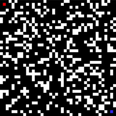

# 🛣️ Pathfinding Simulation

A small interactive pathfinding demo that visualizes different search algorithms.



## 🤖 Search Algorithms
- Breadth-First Search (BFS)
- Depth-First Search (DFS)
- Greedy Best-First Search (GBFS)
- A* Search

## 🎛️ Controls
- **MOUSE LEFT** - Add tiles
- **MOUSE RIGHT** - Remove tiles
- **[ESC]** - Exit application
- **[SPACE]** - Pause/Play pathfinding
- **[G]** - Generate new grid
- **[C]** - Clear screen
- **[R]** - Reset agent
- **[<]** _and_ **[>]** - Change search agent

## ▶️ Installation
1. Clone the repository
2. Install dependencies:
```pip install -r requirements.txt```
3. Run [main.py](main.py):
```python main.py```